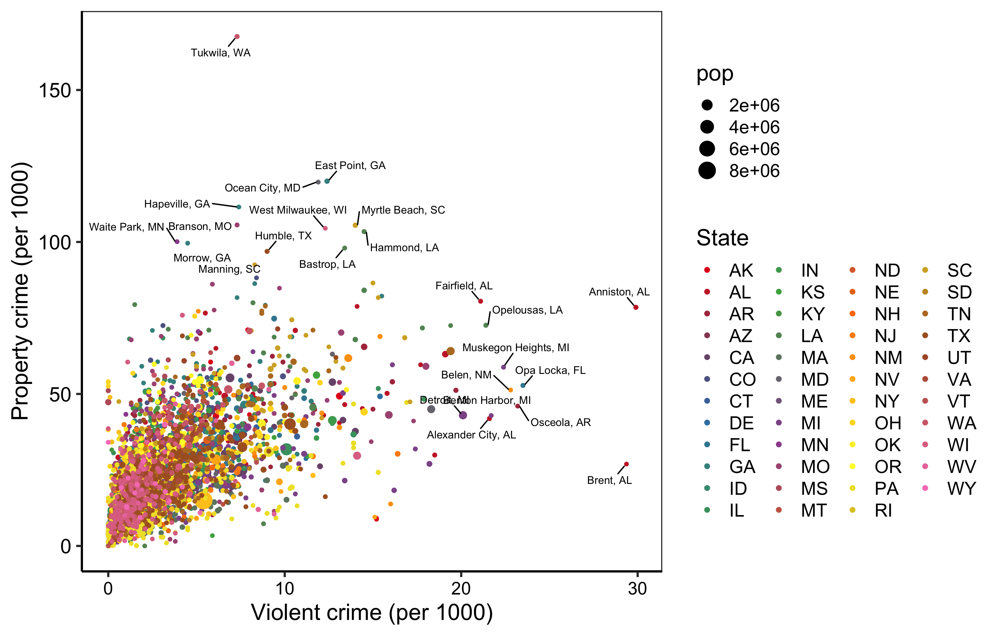

# safewise-data

This data was obtained from [Safewise](https://www.safewise.com), from their Safest Cities of 2020 
blog. E.g., [Colorado's page](https://www.safewise.com/blog/safest-cities-colorado/). This dataset 
is meant to help determine the safest – and least safe? – cities in the United States.

## Notes

- The violent crime (`VC`) and population crime (`PC`) data (both per 1000 residents) are means from 2018-2020. [Methods are described here](https://www.safewise.com/blog/the-safewise-safest-cities-our-methodology/). Cities had to meet a certain population minimum to be counted.
- The number of cities included in the top portion with more information seems to be somewhat random.
- Some states don't have city-level data, data is only for the whole state. These include: North Carolina and Iowa.
- Some states aren't included at all: Hawaii.
- Some states have mistakes in ranking? Such as Wyoming, where the lists appear to go from 1-10, skip 11-20, then restart at 21.
- Some non-states aren't included, even though maybe they should be? (Thinking DC and Puerto Rico should be in the dataset).
- PA has 494 different cities listed. Some states have 30.

## Focus on a random place

Marietta, Georgia:

